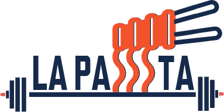

::: {.course-home}

::: {.site-hero}
::: {.site-hero__shade}
:::

::: {.site-hero__inner}

University of Illinois Urbana-Champaign / LA PAISTA Lab

Accelerometer Learning Course

<h1>Turn raw movement signals into reproducible evidence.</h1>

A practical online course for planning accelerometer studies, processing raw movement files, checking quality, and building clean analysis-ready datasets.

<a class="button button-primary" href="accelerometer-introduction.html">Start Module 1</a>
<a class="button button-secondary" href="#course-modules">View modules</a>

:::
:::

::: {.metrics-band aria-label="Course summary"}

<strong>8</strong>applied modules

<strong>3</strong>core tools: ActiLife, GGIR, Stata

<strong>1</strong>end-to-end reproducible workflow

:::

::: {.section-wrap .intro-split}
::: {.section-copy}

Course overview

<h2>Built for research teams who need clean accelerometer data.</h2>

Accelerometry turns continuous movement signals into information about activity, sedentary behavior, and sleep. This course follows the practical decisions that make that transformation credible: device setup, file organization, processing, quality control, cleaning, and documentation.

The examples use ActiGraph, GGIR in R, and Stata. The principles are broader than any one device or software package, and every study should document its own protocol and analytical decisions.

:::

<figure class="media-feature">
<video class="course-video" controls preload="none" poster="images/course-hero.png">
<source src="media/welcome-video.mp4" type="video/mp4" />
Your browser does not support the video tag. You can download the welcome video from <a href="media/welcome-video.mp4">this link</a>.
</video>
<figcaption>Welcome video for the Accelerometer Learning Course.</figcaption>
</figure>
:::

::: {.workflow-section #workflow}
::: {.section-wrap}

Workflow

<h2>From device deployment to analysis-ready evidence.</h2>

::: {.workflow-grid}

01<strong>Collect</strong>
Initialize devices, define placement and wear protocol, and support participant compliance.

02<strong>Download</strong>
Retrieve raw recordings and document return status, dates, and operator decisions.

03<strong>Organize</strong>
Use reproducible folders, IDs, file naming, conversion logs, and transparent storage.

04<strong>Process</strong>
Run GGIR or another approved workflow to calibrate, detect non-wear, and summarize movement.

05<strong>Inspect</strong>
Review plots, missingness, calibration, clipping, valid days, and unusual movement patterns.

06<strong>Deliver</strong>
Clean, standardize, derive outcomes, prepare Stata datasets, and report analytical decisions.

:::
:::
:::

::: {.section-wrap #course-modules}
::: {.section-heading-row}

Course map

<h2>Modules designed around the real research workflow.</h2>

<a class="text-link" href="accelerometer-introduction.html">Begin with Module 1</a>
:::

<a href="accelerometer-introduction.html">Module 1<strong>Accelerometer Introduction</strong>What accelerometers record, what they can estimate, and how placement and protocol shape interpretation.</a>

<a href="accelerometer-programming-and-downloading.html">Module 2<strong>Programming and Downloading</strong>Configure monitors, download recordings, and assess whether collection was complete.</a>

<a href="organizing-and-converting.html">Module 3<strong>Organizing and Converting</strong>Create reproducible folders, file names, batches, and conversion logs.</a>

<a href="setting-up-r-and-ggir.html">Module 4<strong>Setting Up R and GGIR</strong>Prepare R/RStudio, define inputs and outputs, and understand the GGIR workflow.</a>

<a href="checking-data-quality.html">Module 5<strong>Checking Data Quality</strong>Review summaries and visual patterns; document concerns and decisions.</a>

<a href="cleaning-and-standardizing.html">Module 6<strong>Cleaning and Standardizing</strong>Clean GGIR outputs, standardize variables, and preserve a transparent data trail.</a>

<a href="setting-up-final-dataset-in-stata.html">Module 7<strong>Final Dataset in Stata</strong>Import, append, verify, and prepare the final analysis dataset.</a>

<a href="knowledge-checking.html">Module 8<strong>Knowledge Checking</strong>Consolidate the workflow and test key decisions before using study data.</a>

:::

<a href="glossary.html">Study aid<strong>Glossary</strong>Key accelerometer, GGIR, QC, and Stata terms used across the course.</a>

<a href="references.html">Evidence base<strong>References</strong>Bibliographic sources and software documentation cited in the modules.</a>

::: {.section-wrap .decision-panel}

Protocol standard

<h2>Every parameter needs a study reason.</h2>

Device configuration, valid-day rules, wear-time criteria, thresholds, and processing arguments must be selected for the study population, device, wear location, and protocol. This course teaches the decision process; it does not prescribe one universal parameter set.

:::

:::
