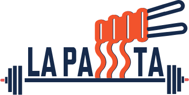

::: {.course-home}

::: {.site-hero}
::: {.site-hero__shade}
:::

::: {.site-hero__inner}

University of Illinois Urbana-Champaign / LA PASSSTA Lab

University research workflow · Self-paced

<h1>Turn raw movement signals into reproducible evidence.</h1>

Learn the complete accelerometer workflow—from study decisions and device deployment to quality review and an analysis-ready dataset.

<a class="button button-primary" href="intake.html">Begin the course</a>
<a class="button button-secondary" href="#course-modules">Explore the modules</a>

:::
:::

::: {.metrics-band aria-label="Course summary"}

<strong>8</strong>guided stages from concepts to final check

<strong>10</strong>captioned videos with summaries and transcripts

<strong>1</strong>downloadable toolkit for hands-on practice

:::

::: {.section-wrap .intro-split}
::: {.section-copy}

Why this course

<h2>Build the evidence trail—not just the output.</h2>

Accelerometers record acceleration, not ready-made measures of activity, sedentary behavior, or sleep. Credible results depend on the decisions made before, during, and after data collection.

This course connects those decisions into one practical workflow: define the protocol, preserve traceability, process raw files, interrogate data quality, and deliver a dataset another analyst can understand. Examples use ActiGraph, GGIR in R, and Stata, while the underlying principles extend beyond any one tool.

:::

<figure class="media-feature">
<video class="course-video" controls preload="none" playsinline poster="images/course-hero.webp">
<source src="media/welcome-video.mp4" type="video/mp4" />
<track kind="captions" src="captions/welcome-video.vtt" srclang="en" label="English" />
Your browser does not support the video tag. You can download the welcome video from <a href="media/welcome-video.mp4">this link</a>.
</video>
<figcaption>Welcome video for the Accelerometer Learning Course.</figcaption>
</figure>

Quick summary Brief review

This course follows accelerometer data from study planning and device deployment through downloading, organization, GGIR processing, quality control, cleaning, and creation of an analysis-ready Stata dataset. Throughout the workflow, study-specific decisions and reproducible documentation are treated as essential.

<!-- transcript:welcome-video -->

Read the full video transcript Timestamped · English

<a href="captions/welcome-video.vtt" download>Download English captions (.vtt)</a>

00:00 Welcome to the Accelerometer Learning Course. Accelerometers are powerful research tools because they let us move beyond self-report and observe patterns of movement, rest, and sleep over time. But

00:13 collecting accelerometer data is only the beginning. To turn a device recording into a trustworthy research dataset, every step has to be planned, documented, and checked. This course gives you a practical workflow for doing that work

00:28 from start to finish. We begin with the core concepts. What does an accelerometer record? What kinds of outcomes can it support? Why do device placement and study protocol matter? Then we move into the hands-on workflow. Accelerometry

00:44 turns raw movement into insight about how people move, rest, and sleep. Over eight modules, you&#x27;ll learn the complete workflow. Module 1 introduces the accelerometer—what it records, and how placement shapes the data. Module 2

00:57 covers programming and downloading the device. Module 3, organizing and converting your files. Module 4 sets up R and GGIR to process the data. Module 5 checks data quality. Module 6 cleans and standardizes the output. Module 7 builds

01:13 the final dataset in Stata. And Module 8 is a knowledge check to consolidate what you&#x27;ve learned. After that, we show how raw device files can be converted and processed. The course uses ActiLife, R, GGIR, and Stata as the main examples.

01:29 These tools help move the data from raw acceleration signals into interpretable summaries of physical activity, sedentary behavior, and sleep-wake patterns. Just as important, you will learn how to inspect data quality. A single summary

01:45 number can hide problems, so the course emphasizes visual checks, clear decision rules, and careful notes about exclusions or concerns. By the end of the course, you should understand the complete path from planning and deploying

01:57 an accelerometer to preparing an analysis-ready dataset. You will also know where protocol decisions must be adapted for the population, device, wear location, and research question in your own study. This course is designed for

02:12 students, research assistants, and lab members who want a clear, reproducible introduction to accelerometer-based measurement. Start with the first module, accelerometer introduction, and then follow the workflow step-by-step. Welcome

02:25 to the course.

:::

::: {.section-wrap}

Choose your route

<h2>Learn the logic, then decide how far to practise it.</h2>

::: {.workflow-grid .compact}

3–4 hours<strong>Concept route</strong>
Read the lessons, watch the videos or use their transcripts, and complete the self-checks. A web browser is sufficient.

6–9 hours<strong>Hands-on route</strong>
Add every mini-activity and save the stated deliverables. Timing excludes software installation and full-dataset processing.

:::

::: {.review-note}
<strong>Hands-on prerequisites:</strong> Bring an approved or fictional study protocol and a safe practice dataset with no direct identifiers. Modules 2–3 require access to a compatible ActiGraph device and ActiLife for the demonstrated workflow. Modules 4–6 use R, RStudio, and GGIR. Module 7 uses Stata. ActiLife and Stata access may depend on your laboratory or institution's licensing. Record the exact device, firmware, and software versions used in your own project.
:::
:::

::: {.workflow-section #audience}
::: {.section-wrap}

Who can use this course

<h2>Built for learners and teams who work with movement data.</h2>

The concept route is suitable for beginners with a web browser. The hands-on route is for learners who also have access to an approved or fictional protocol, safe practice data, and the demonstrated software or devices.

::: {.workflow-grid}

Study<strong>Undergraduate and graduate students</strong>
Build a foundation in accelerometry for kinesiology, public health, epidemiology, data science, or related coursework and research.

Research operations<strong>Research assistants and study teams</strong>
Use a shared workflow for device deployment, file traceability, quality review, and preparation of analysis-ready data.

Teaching and leadership<strong>Faculty, instructors, and investigators</strong>
Support methods teaching, laboratory onboarding, protocol planning, and review of reproducible research practices.

Practice<strong>Health and movement professionals</strong>
Understand how wearable data are collected and interpreted in public health, clinical, exercise, and human-movement settings.

Analysis<strong>Data analysts and methodologists</strong>
Connect raw-device decisions with GGIR processing, quality-control evidence, documented cleaning, and final datasets.

Industry<strong>Company and consulting teams</strong>
Develop shared literacy for work in wearable technology, digital health, occupational health, research services, and related fields.

:::
:::
:::

::: {.section-wrap #course-modules}
::: {.section-heading-row}

Module-by-module

<h2>Follow the workflow in order, with a useful output at every stage.</h2>

<a class="text-link" href="accelerometer-introduction.html">Begin with Module 1</a>
:::

<a href="accelerometer-introduction.html">Design · Module 1 · 50–70 min<strong>Accelerometer Introduction</strong>Turn a research question into a draft device, placement, and wear-protocol decision.</a>

<a href="accelerometer-programming-and-downloading.html">Capture · Module 2 · 30–45 min<strong>Programming and Downloading</strong>Create a reconciled initialization and download record from an approved protocol.</a>

<a href="organizing-and-converting.html">Trace · Module 3 · 25–40 min<strong>Organizing and Converting</strong>Produce a folder map, naming rule, and documented conversion decision.</a>

<a href="setting-up-r-and-ggir.html">Process · Module 4 · 45–75 min<strong>Setting Up R and GGIR</strong>Build a versioned GGIR configuration and verify it on raw practice files.</a>

<a href="checking-data-quality.html">Review · Module 5 · 35–60 min<strong>Checking Data Quality</strong>Record the evidence, decisions, and follow-up actions in a transparent QC log.</a>

<a href="cleaning-and-standardizing.html">Standardize · Module 6 · 40–70 min<strong>Cleaning and Standardizing</strong>Produce a cleaned file, data dictionary, and reproducible exclusion record.</a>

<a href="setting-up-final-dataset-in-stata.html">Integrate · Module 7 · 30–50 min<strong>Final Dataset in Stata</strong>Deliver a verified analysis dataset with merge checks and a reproducible do-file.</a>

<a href="knowledge-checking.html">Consolidate · 20–30 min<strong>Knowledge Check</strong>Apply the full workflow to a scenario, justify key choices, and flag records for follow-up.</a>

::: {.review-note}
<strong>Completion standard:</strong> For the concept route, complete each module's self-check and explain the decision in your own words. For the hands-on route, also save the stated module deliverable in a versioned project folder. Passing the final knowledge check, completing every module, and submitting final feedback unlocks the course certificate.
:::
:::

::: {.section-wrap}
::: {.section-heading-row}

Carry the work forward

<h2>Resources designed to stay useful after the lesson ends.</h2>

<a class="text-link" href="toolkit.html">Open the toolkit</a>
:::

<a href="toolkit.html">Practice resources<strong>Course Toolkit</strong>Download study logs, synthetic data, R and Stata examples, and the capstone.</a>

<a href="glossary.html">Study aid<strong>Glossary</strong>Key accelerometer, GGIR, QC, and Stata terms used across the course.</a>

<a href="references.html">Evidence base<strong>References</strong>Bibliographic sources and software documentation cited in the modules.</a>

<a href="course-information.html">Trust and access<strong>Course Information</strong>Version, accessibility, privacy, AI-video transparency, citation, and contact.</a>

:::

::: {.workflow-section}
::: {.section-wrap}
::: {.section-heading-row}

Built for scrutiny

<h2>A course you can inspect as well as complete.</h2>

<a class="text-link" href="course-information.html">Review course information</a>
:::

::: {.workflow-grid}

Stewardship<strong>University research context</strong>
Developed and maintained by the LA PASSSTA Lab at the University of Illinois Urbana-Champaign.

Traceability<strong>Versioned and documented</strong>
Version 1.2.0 records its review date, GGIR technical baseline, references, revisions, and known limitations.

Access<strong>Designed for review</strong>
No account is required. Every video includes captions, a concise summary, and a readable transcript; progress stays in your browser.

:::

<h3>Course creators</h3>

::: {.workflow-grid}

Course creator<strong><a href="https://lemann.illinois.edu/directory/profile/leao">Otávio Leão</a></strong>

Course creator<strong>Eryx Lee</strong>

Course creator<strong>Maynor Antonio Antonio</strong>

:::

::: {.review-note}
<strong>Research safeguard:</strong> Course settings and thresholds are worked examples, not universal defaults. Select every parameter for the study population, device, wear location, research question, approved protocol, and exact software version.
:::
:::
:::

<section class="faq-section" id="faq" aria-labelledby="faq-heading">

Questions before you begin

<h2 id="faq-heading">Frequently asked questions</h2>

Find the practical details first, then review the decisions that must be adapted for your own study.

<h3>Getting started</h3>

Who is this course for?

It is designed for undergraduate and graduate students; research assistants, coordinators, and laboratory teams; faculty, instructors, and investigators; public-health, clinical, exercise, and movement professionals; data analysts and methodologists; and company or consulting teams working in wearable technology, digital health, occupational health, or research services. The concept route is beginner-friendly, while the hands-on route requires appropriate software, devices, and safe practice data.

How long does the course take?

Allow about 3–4 hours for the concept route or 6–9 hours for the hands-on route. Full-dataset processing, software installation, and protocol approval take additional time. Each module card shows a planning estimate.

Which devices and software does the course use?

The examples use ActiGraph devices, ActiLife, GGIR in R, and Stata. You can complete the concept route in a browser. Hands-on work requires appropriate software and a safe practice dataset; access to ActiLife and Stata may depend on your laboratory or institution's licensing.

Do I need previous experience with R, GGIR, or Stata?

No prior experience is required for the concept route. For the hands-on route, you should be comfortable finding files, editing paths, running a script, reading software messages, and protecting participant data. Basic familiarity with R and Stata is helpful in Modules 4–7.

How can I use the videos accessibly?

Each video is followed by a quick summary, a full transcript, and a downloadable caption track. The summary is for rapid review; it is not a substitute for the transcript or captions. Software controls and visual-only details are described in the accompanying text where they affect the task.

How do I know that I completed a module?

Complete the self-check and compare your reasoning with the feedback. On the hands-on route, also save the module's stated deliverable—for example, a protocol decision, download log, GGIR configuration, QC log, or analysis script.

<h3>Methods and files</h3>

What does an accelerometer measure directly?

It records acceleration over time, usually along three axes. Behaviors such as activity intensity, sedentary time, posture, and sleep are estimates derived from the raw signal using a documented algorithm, wear location, and protocol.

Does GGIR require conversion from <code>.gt3x</code> to <code>.csv</code>?

No. GGIR can read <code>.gt3x</code> files directly. Convert to CSV only when a downstream script, another software package, data-sharing requirement, or audit workflow specifically needs it.

What is the difference between <code>.gt3x</code> and <code>.agd</code> files?

A <code>.gt3x</code> file contains raw ActiGraph acceleration data. The demonstrated workflow also creates a 10-second <code>.agd</code>, a count-based epoch summary that may be useful for ActiLife review or legacy workflows. Follow the approved protocol if it specifies another epoch length.

What counts as a valid participant record?

The course example uses at least 4 valid days, at least 10 hours of awake wear per valid day, and at least 1 weekend day. These are example rules and must be approved for the study population, device, placement, and protocol.

Are the course thresholds and cleaning rules universal?

No. Device settings, valid-day rules, intensity thresholds, wear criteria, and variable-specific cleaning rules are study-specific examples. Confirm every rule against the approved protocol, the exact software version, and the relevant output dictionary before applying it.

What should the final analysis package contain?

Include a dated <code>.dta</code> file, data dictionary, cleaning log, exclusion table, Stata do-file, and a README that identifies the source GGIR run and processing batches.

</section>

::: {.section-wrap .decision-panel}

Ready when you are

<h2>Start with the research question.</h2>

Module 1 turns that question into the first documented device, placement, and wear-protocol decisions. You can return to the toolkit and transcripts at any point.

<a class="button button-primary" href="intake.html">Start with the questionnaire</a>
<a class="button text-link" href="toolkit.html">Preview the toolkit</a>

:::

:::
